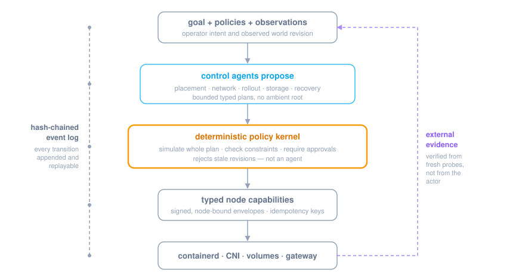

# a4s

`a4s` is a control-plane experiment for replacing K3s with agentic
infrastructure. The name is provisional.

This is infrastructure controlled by agents. Workloads remain ordinary OCI
containers, services, jobs, databases, and gateways.

Agent workloads are one of those kinds, not the point of the system. The word
"agent" names two separate objects here: a **control agent** proposes typed
plans and holds infrastructure capabilities, while an **agent workload** is
scheduled cargo that proposes nothing and reaches the world through granted
tools. Their authority vocabularies are deliberately disjoint. See
[agent workloads](docs/agent-workloads.md).

## Thesis

Kubernetes reconciles a large graph of low-level resources with fixed
controllers. a4s starts from an operator goal and a stream of observed facts.
Specialized control agents propose bounded plans for placement, rollout,
networking, storage, security, and recovery. A deterministic kernel—not an
agent—checks and executes those plans.

<p align="center">
  
</p>

Agents never receive ambient root or shell access. They can only propose typed
actions granted to their role. Every proposal is bound to an observed world
revision, simulated as a complete plan, checked against hard constraints and
approvals, executed with idempotency keys, and verified from fresh evidence.

## What the spike proves

The current code implements both the control-plane contract and the first real
node-runtime boundary:

- `Goal`, `World`, `Agent`, `Proposal`, `Action`, `Policy`, and `Evidence`.
- A durable, hash-chained controller event log.
- Separate placement and network agents.
- Revision-bound proposals and stale-plan rejection.
- Capability grants per control agent.
- Whole-proposal simulation before mutation.
- Placement-label and capacity enforcement.
- Digest-pinned images and privileged-workload rejection.
- Explicit approval before public exposure.
- Execution evidence and independent goal verification.
- Ed25519-signed, node-bound action envelopes with short expiry.
- A durable node idempotency ledger that survives daemon restart.
- A Linux node adapter for containerd pull/create/start with digest checks,
  resource limits, no-new-privileges, empty capabilities, and namespaced
  cgroups.

The controller simulation and Linux node command are not connected by a
network transport yet. The node command deliberately accepts a stream of
signed envelopes on standard input; this exercises the security and runtime
contract before choosing HTTP, QUIC, NATS, or another transport.

The example is an ordinary public web service and exercises only general
infrastructure primitives.

```bash
go test ./...
go run ./cmd/a4s validate --file examples/web-service.json
go run ./cmd/a4s simulate --file examples/web-service.json
```

An agent workload runs through the same loop, adding a budget reservation and a
tool-envelope grant before it starts:

```bash
go run ./cmd/a4s simulate --file examples/agent-workload.json
```

Expected reconciliation for the web service, with the actor column omitted. The
route is published only after a prober measures the allocation ready, so
readiness is observed rather than assumed:

```text
goal.accepted         operator
proposal.created      placement-agent
proposal.approved     policy-kernel
action.dispatched     pull_image
action.completed      pull_image
action.dispatched     create_allocation
action.completed      create_allocation
action.dispatched     attach_network
action.completed      attach_network
action.dispatched     start_allocation
action.completed      start_allocation
observation.recorded  allocation.ready
proposal.created      network-agent
proposal.approved     policy-kernel
action.dispatched     publish_route
action.completed      publish_route
goal.achieved         verifier
```

The next vertical slice connects server and node, adds independent process and
HTTP probes, then implements CNI and a local gateway. See
[the node runtime](docs/node-runtime.md) for the exact boundary and Linux smoke
test.

## Documentation

Start with the [documentation index](docs/index.md). The essential handoff set
is:

- [Project status](docs/project-status.md): exact implementation inventory and
  next milestone.
- [Getting started](docs/getting-started.md): build, test, simulation, and Linux
  requirements.
- [Architecture](docs/architecture.md): complete target design and K3s
  replacement map.
- [Control protocol](docs/control-protocol.md): current objects, actions,
  events, and signed envelopes.
- [Security model](docs/security.md): trust boundaries, threat model, and
  production blockers.
- [Codebase guide](docs/codebase.md): package ownership and extension paths.
- [Operations](docs/operations.md): disposable Linux-node runbook and recovery
  behavior.
- [Roadmap](docs/roadmap.md): ordered milestones and exit criteria.

## Moving the project

This directory is self-contained: it has its own Go module, dependency lock,
project instructions, changelog, examples, and handbook. It can be copied into
a new directory or repository without the original infrastructure checkout.

The module path remains `github.com/arcbjorn/a4s` after a local move. Change it
only if publishing under a new import path; instructions are in the
[documentation index](docs/index.md). No license has been selected yet, so add
one before public distribution or accepting external contributions.
